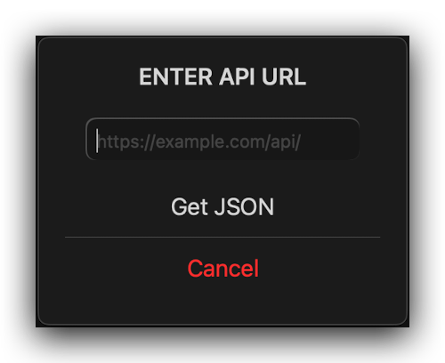
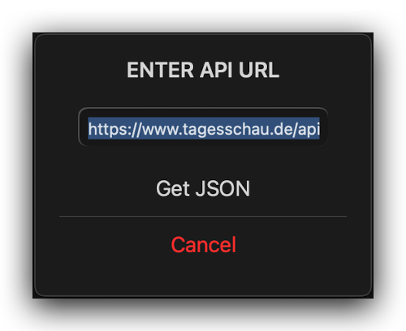
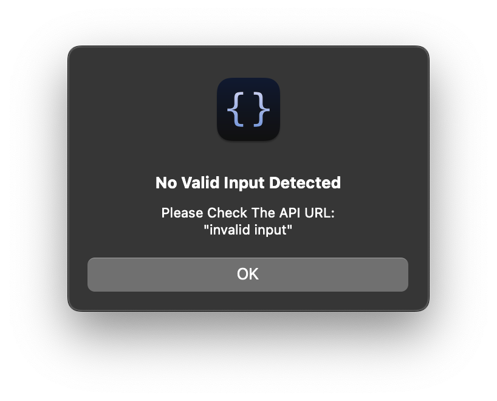

# JSON-API-Viewer for Scriptable

### Features
If the device clipboard includes `https://` it will filled automatically in the field.

  
  

 

If the input is no URL or the api didn't answer (_in JSON Format_) you'll get an issue alert.

  

  
 

When the API answer has the correct response format it will shown via `QuickLook.present(response, false)`

  

  
 
___

  
  

